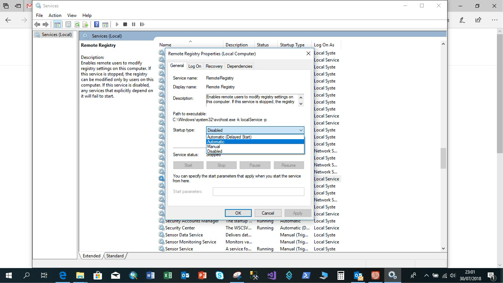

# TerrSet v18.31 Installation and License Manager

The TerrSet System requires every copy to be activated and licensed to a particular computer within 30 days of installation. Until activated, TerrSet will run in Trial Mode, allowing full access to the program for those 30 days.

You should be logged onto the computer as a user with admin rights in order to run the installation successfully.  In addition, it is best to run the setup file As Administrator.

## TerrSet Installation and the TerrSet License Manager

The TerrSet License Manager is used to activate and manage your TerrSet stand-alone or multi-seat license. To activate, locate the TerrSet program group accessed from the Windows Start Menu, and select the TerrSet License Manager. Then follow the instructions on each page.

To activate, make sure you have your License ID and Password ready. These would have been supplied to you by Clark Labs via email, after Clark Labs has processed your order. You must be connected to the internet to activate your license. If you do not have access to the internet at the time of activation, please contact Clark Labs.

If you are not yet ready to activate the software, merely launch TerrSet. You will be prompted with a message informing you of the number of days left in *Trial Mode*. You will also be given the option to activate your copy of TerrSet or to open TerrSet in trial mode.

## Multi-Seat License Installation and Activation

### Server

TerrSet must first be installed and activated on the server before activating any networked clients. During the installation, you have the option of installing the full application or only the license manager files on the server. The latter option installs only those files needed to manage client machines from a server. The full application must be installed on all the clients.

If you install only the TerrSet License Manager files on the server, locate the `TSLICMGR.EXE` file in the installed TerrSet application folder (e.g., `C:\Program Files (x86)\TerrSet\`) and right-click to “Run as Administrator.” If you install the full TerrSet application on the server, locate the TerrSet License Manager from the TerrSet program group. Follow the activation instructions for Server activation. Note that the multi-seat license activation requires internet connection.

An important step in the multi-seat activation process is the specification of the UNC path. To provide a license to client machines, the license folder on the server must be shared to *Everyone* with change and read rights. Also, NTFS permissions on the license folder must be set to modify/delete for all relevant users and/or groups. Setting these permissions and share must be done before the server is activated. By default the license folder on the server can be found in `C:\Program Files (x86)\TerrSet\License\` folder.

This shared folder on the server is the UNC path to be specified during the server and client activations. The UNC path is typically `\\<servername>\<sharename>\TerrSet.lic`. The variable `<servername>` can either be the server name or its IP address. If client machines are on a different subnet then using the IP address of the server will ensure that the client can find the server.

### Clients

To activate clients, launch the TerrSet License Manager, select Client (Network) and enter the full path and filename of the license file on the server, e.g., `\\<servername>\<sharename>\TerrSet.lic`.

**Special Note for Administrators**

When activating a client through the TerrSet License Manager, a text file named `floatpath` is created in the server’s TerrSet\License folder containing the UNC path, typically under `C:\Program Files (x86)\TerrSet\License`. Additional clients may be activated by copying this floatpath file to the local `TerrSet\License` folder on the client machines, thus avoiding the need to run the License Manager on every client.

For info about parameters for Silent installations visit [here](https://forums.clarklabs.org/hc/en-us/articles/12995347566227-Silent-installations-additional-info-for-network-administrators)

## Moving a TerrSet License to Another Machine

To move your TerrSet license to another machine, or before reformatting your system drive, you must first deactivate your current license. This requires online access. Open the TerrSet License Manager, enter your License ID and Password, then select Deactivate. You should receive a successful deactivation message. Now you may install TerrSet on a new machine, using the same License ID and Password from your former machine. If you do not have online access, contact Clark Labs.

## Remote Registry Error on Installation

During TerrSet installation, some users may receive a Windows error related to Remote Registry: “The service cannot be started, either because it is disabled or because it has no enabled devices associated with it.  Remote Registry. Would you like to try again?” If you get this error, you can try to click no to all. Also, you can log into your machine as an Administrator and check the Remote Registry Startup Type to be set to “Automatic”. You can access Remote Registry settings through your computer Services.

This service can be disabled after installation.

  

